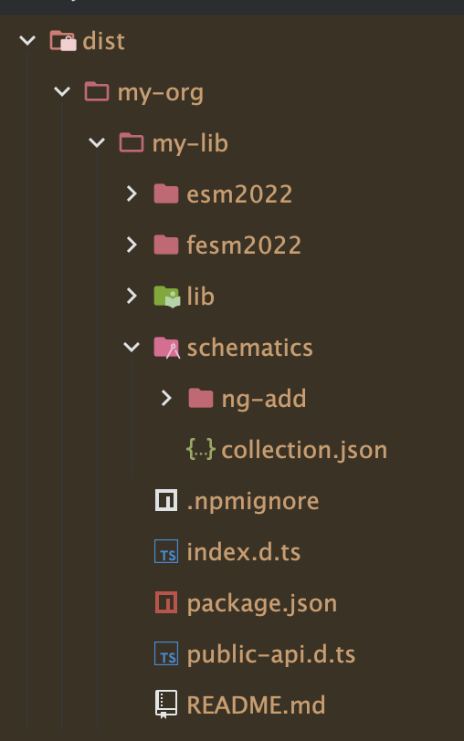

# Ship Angular Schematics with library

A test for shipping angular schematics with a library

clone project
npm i
build the library and schematics: ng build my-lib && cd my-lib and npm run build:schematics

Output in the dist should be:


Publish the library using verdaccio (publishconfig is already set in package.json in projects/my-lib)

Afterwards you can install the lib on a new project and run the schematics: ng add @my-org/my-lib 
this will execute the ng-add schematic and give following output
```
ℹ Using package manager: npm
✔ Found compatible package version: @my-org/my-lib@0.0.3.
✔ Package information loaded.

The package @my-org/my-lib@0.0.3 will be installed and executed.
Would you like to proceed? Yes
✔ Packages successfully installed.
    ✅️ Running ng-add for my-lib
✔ Packages installed successfully.
Nothing to be done.

```
